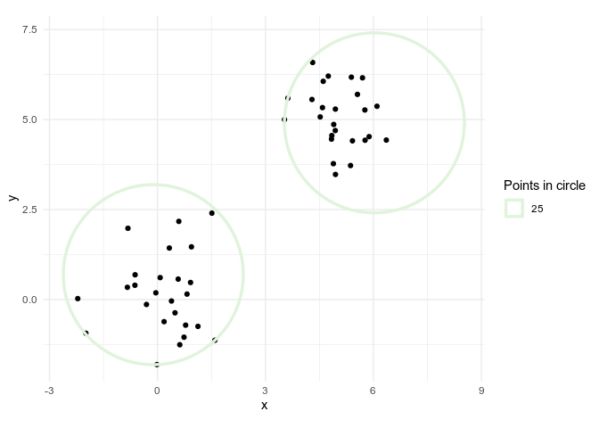
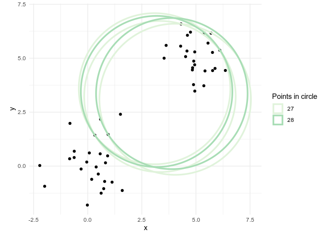
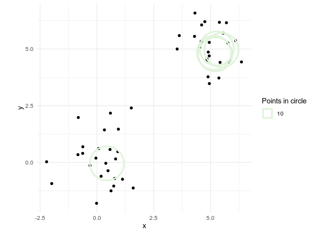

<!-- README.md is generated from README.Rmd. Please edit that file -->

# angularsweep

<!-- badges: start -->

<!-- badges: end -->

`angularsweep` contains functions which implement the angular sweep
algorithm in order to determine the circle with specified radius which
contains the maximum number of a provided set of points in two
dimensional space.

The `sweep_points()` function will apply the algorithm to a data frame
of points in two dimensions. The `sweep_latlons` function will attempt
to re-project coordinates to do the same for geographic locations.

It can also apply the same algorithm with a weighting variable: giving
the circle with the weighted maximum number of points within it. This
could be used, for example, to identify the circle containing the
largest aggregate value of a number of buildings, given their values.

## Installation

You can install the released version of angularsweep from GitHub with
the following command:

``` r
remotes::install_github("https://github.com/gtm19/angularsweep")
```

## Points Example

First constructing an arbitrary data frame of points clustered around
two points:

``` r
library(ggplot2)
library(ggforce)
library(angularsweep)

set.seed(1)
points <-
  data.frame(
    x = c(
      rnorm(25, 0),
      rnorm(25, 5)
    ),
    y = c(
      rnorm(25, 0),
      rnorm(25, 5)
    ),
    group = c(
      rep(1, 25),
      rep(2, 25)
    )
  )

point_plot <- 
  ggplot(points, aes(x, y)) +
  geom_point() +
  coord_equal() +
  labs(colour = "Points in circle") +
  scale_color_brewer(palette = "GnBu")
```

It seems clear that ascertaining the circles with radius `2.5` with the
largest number of points within is going to yield at most two circles
with 25 points in each:

``` r
r <- 2.5

point_sweep <-
  sweep_points(points, xcol = "x", ycol = "y", radius = r)
#> Computing distance matrix
#> Distance matrix...done
#>   |                                                                              |                                                                      |   0%  |                                                                              |=                                                                     |   2%  |                                                                              |===                                                                   |   4%  |                                                                              |====                                                                  |   6%  |                                                                              |=====                                                                 |   8%  |                                                                              |=======                                                               |  10%  |                                                                              |========                                                              |  11%  |                                                                              |=========                                                             |  13%  |                                                                              |===========                                                           |  15%  |                                                                              |============                                                          |  17%  |                                                                              |=============                                                         |  19%  |                                                                              |================                                                      |  22%  |                                                                              |=================                                                     |  24%  |                                                                              |==================                                                    |  26%  |                                                                              |====================                                                  |  28%  |                                                                              |=====================                                                 |  30%  |                                                                              |======================                                                |  32%  |                                                                              |========================                                              |  34%  |                                                                              |=========================                                             |  36%  |                                                                              |===========================                                           |  38%  |                                                                              |============================                                          |  41%  |                                                                              |==============================                                        |  42%  |                                                                              |===============================                                       |  44%  |                                                                              |================================                                      |  46%  |                                                                              |==================================                                    |  48%  |                                                                              |===================================                                   |  50%  |                                                                              |====================================                                  |  52%  |                                                                              |======================================                                |  54%  |                                                                              |=======================================                               |  56%  |                                                                              |=========================================                             |  58%  |                                                                              |==========================================                            |  60%  |                                                                              |============================================                          |  62%  |                                                                              |=============================================                         |  64%  |                                                                              |==============================================                        |  66%  |                                                                              |================================================                      |  68%  |                                                                              |=================================================                     |  70%  |                                                                              |===================================================                   |  72%  |                                                                              |====================================================                  |  74%  |                                                                              |=====================================================                 |  76%  |                                                                              |=======================================================               |  78%  |                                                                              |========================================================              |  80%  |                                                                              |==========================================================            |  82%  |                                                                              |===========================================================           |  84%  |                                                                              |============================================================          |  86%  |                                                                              |==============================================================        |  88%  |                                                                              |===============================================================       |  90%  |                                                                              |================================================================      |  92%  |                                                                              |==================================================================    |  94%  |                                                                              |===================================================================   |  96%  |                                                                              |===================================================================== |  98%  |                                                                              |======================================================================| 100%

point_plot +
  geom_circle(data = point_sweep[1:2,], 
              aes(x0 = x, y0 = y, r = r, colour = factor(total)), 
              inherit.aes = FALSE,
              size = 1.2)
```



However, increasing the radius to traverse the two clusters can result
in a circle with more than 25 points within.

``` r

r <- 3.5

point_sweep <-
  sweep_points(points, xcol = "x", ycol = "y", radius = r)
#> Computing distance matrix
#> Distance matrix...done
#>   |                                                                              |                                                                      |   0%  |                                                                              |=                                                                     |   2%  |                                                                              |==                                                                    |   3%  |                                                                              |===                                                                   |   5%  |                                                                              |=====                                                                 |   7%  |                                                                              |=======                                                               |  10%  |                                                                              |========                                                              |  12%  |                                                                              |==========                                                            |  14%  |                                                                              |===========                                                           |  15%  |                                                                              |============                                                          |  18%  |                                                                              |==============                                                        |  19%  |                                                                              |===============                                                       |  22%  |                                                                              |=================                                                     |  24%  |                                                                              |==================                                                    |  26%  |                                                                              |===================                                                   |  28%  |                                                                              |=====================                                                 |  30%  |                                                                              |======================                                                |  32%  |                                                                              |=======================                                               |  33%  |                                                                              |=========================                                             |  36%  |                                                                              |==========================                                            |  38%  |                                                                              |============================                                          |  41%  |                                                                              |==============================                                        |  43%  |                                                                              |===============================                                       |  45%  |                                                                              |=================================                                     |  47%  |                                                                              |==================================                                    |  48%  |                                                                              |===================================                                   |  50%  |                                                                              |====================================                                  |  52%  |                                                                              |======================================                                |  54%  |                                                                              |========================================                              |  57%  |                                                                              |=========================================                             |  59%  |                                                                              |===========================================                           |  61%  |                                                                              |============================================                          |  63%  |                                                                              |==============================================                        |  65%  |                                                                              |===============================================                       |  67%  |                                                                              |================================================                      |  69%  |                                                                              |==================================================                    |  71%  |                                                                              |===================================================                   |  73%  |                                                                              |=====================================================                 |  75%  |                                                                              |======================================================                |  77%  |                                                                              |=======================================================               |  79%  |                                                                              |========================================================              |  81%  |                                                                              |==========================================================            |  83%  |                                                                              |===========================================================           |  85%  |                                                                              |============================================================          |  86%  |                                                                              |=============================================================         |  88%  |                                                                              |===============================================================       |  89%  |                                                                              |================================================================      |  91%  |                                                                              |==================================================================    |  94%  |                                                                              |===================================================================   |  96%  |                                                                              |===================================================================== |  98%  |                                                                              |======================================================================| 100%

point_plot +
  geom_circle(data = point_sweep[1:5,], 
              aes(x0 = x, y0 = y, r = r, colour = factor(total)), 
              inherit.aes = FALSE,
              size = 1.2)
```



Likewise, picking a smaller radius will help locate local clusters of
points:

``` r

r <- 0.75

point_sweep <-
  sweep_points(points, xcol = "x", ycol = "y", radius = r)
#> Computing distance matrix
#> Distance matrix...done
#>   |                                                                              |                                                                      |   0%  |                                                                              |=                                                                     |   2%  |                                                                              |===                                                                   |   4%  |                                                                              |====                                                                  |   6%  |                                                                              |=====                                                                 |   7%  |                                                                              |======                                                                |   9%  |                                                                              |=======                                                               |  10%  |                                                                              |========                                                              |  12%  |                                                                              |==========                                                            |  14%  |                                                                              |===========                                                           |  16%  |                                                                              |=============                                                         |  19%  |                                                                              |===============                                                       |  22%  |                                                                              |================                                                      |  23%  |                                                                              |=================                                                     |  24%  |                                                                              |==================                                                    |  26%  |                                                                              |====================                                                  |  28%  |                                                                              |====================                                                  |  29%  |                                                                              |=====================                                                 |  30%  |                                                                              |=======================                                               |  33%  |                                                                              |=========================                                             |  36%  |                                                                              |==========================                                            |  38%  |                                                                              |============================                                          |  40%  |                                                                              |==============================                                        |  42%  |                                                                              |================================                                      |  45%  |                                                                              |==================================                                    |  48%  |                                                                              |===================================                                   |  50%  |                                                                              |=====================================                                 |  53%  |                                                                              |=======================================                               |  55%  |                                                                              |========================================                              |  57%  |                                                                              |==========================================                            |  60%  |                                                                              |============================================                          |  62%  |                                                                              |=============================================                         |  64%  |                                                                              |==============================================                        |  65%  |                                                                              |================================================                      |  68%  |                                                                              |=================================================                     |  70%  |                                                                              |===================================================                   |  74%  |                                                                              |=====================================================                 |  76%  |                                                                              |=======================================================               |  79%  |                                                                              |=========================================================             |  81%  |                                                                              |==========================================================            |  83%  |                                                                              |===========================================================           |  85%  |                                                                              |=============================================================         |  88%  |                                                                              |==============================================================        |  89%  |                                                                              |================================================================      |  91%  |                                                                              |=================================================================     |  93%  |                                                                              |===================================================================   |  96%  |                                                                              |====================================================================  |  98%  |                                                                              |======================================================================| 100%

point_plot +
  geom_circle(data = point_sweep[1:5,], 
              aes(x0 = x, y0 = y, r = r, colour = factor(total)), 
              inherit.aes = FALSE,
              size = 1.2)
```


